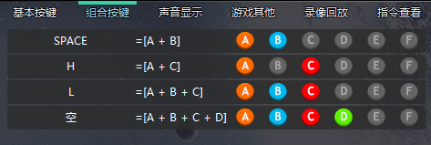

# GameHelper
街机游戏按键辅助，推荐[游聚游戏平台](http://www.gotvg.com/)

**如果脚本无效，请使用管理员身份运行。**

**请更改基础键位**

[下载地址🕹🎮](https://github.com/doghappy/GameHelper/releases)

# 支持游戏

## 恐龙快打

出招表：
- ⬇⬆A: q
- 连发：j (按住不放)

## 西游释厄传

出招表：
- 升龙斩：q
- 元神出窍：e/r
- 变小：o
- 遁入幻境：v
- 乾坤波动功：f
- 二段波动功：c
- 看宝A兵：y
- 乾坤十连斩：n（需要开启对应角色的辅助，AC绑定H）
- 暂停：ctrl + f12
- 暂停十连斩：ctrl + f11